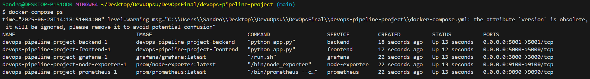
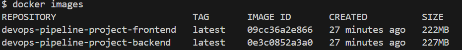
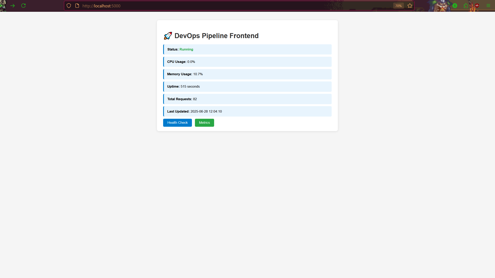
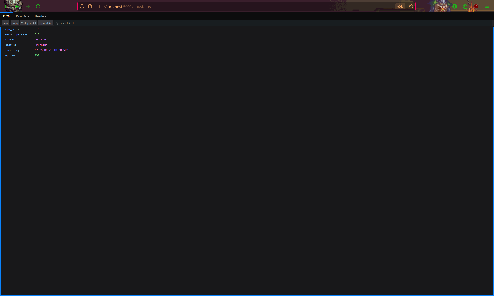
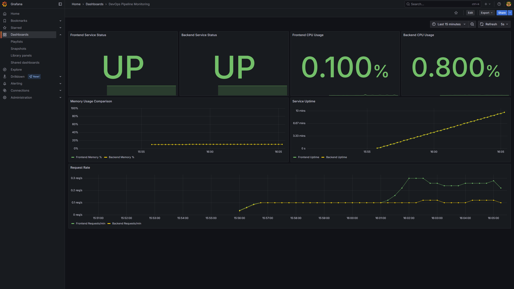
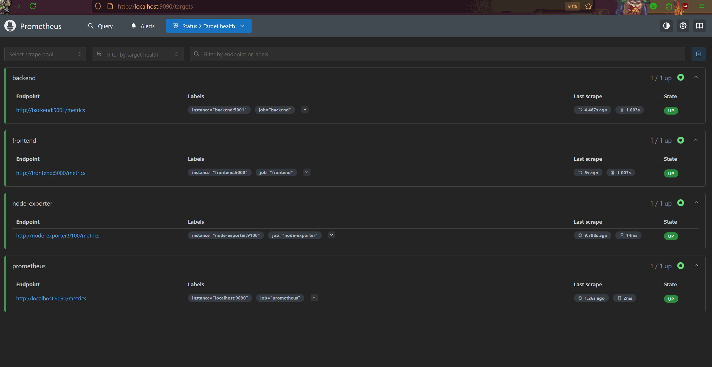

# DevOps Pipeline Project

A comprehensive multi-service application demonstrating modern DevOps practices including containerization, monitoring, security scanning, and incident management.

## 📋 Prerequisites

### For Windows Users (Recommended Setup)

1. **Install WSL2 and Ubuntu:**
   ```powershell
   # Run in PowerShell as Administrator
   wsl --install -d Ubuntu
   # Restart your computer when prompted
   ```

2. **Install Docker Desktop:**
   - Download from [https://www.docker.com/products/docker-desktop/](https://www.docker.com/products/docker-desktop/)
   - Install with WSL2 backend enabled
   - Start Docker Desktop and ensure WSL2 integration is enabled for Ubuntu

3. **Install Git:**
   ```bash
   # In WSL2 Ubuntu terminal
   sudo apt update
   sudo apt install git -y
   ```

4. **Install Trivy (Security Scanner):**
   ```bash
   # In WSL2 Ubuntu terminal
   sudo apt-get install wget apt-transport-https gnupg lsb-release
   wget -qO - https://aquasecurity.github.io/trivy-repo/deb/public.key | sudo apt-key add -
   echo "deb https://aquasecurity.github.io/trivy-repo/deb $(lsb_release -sc) main" | sudo tee -a /etc/apt/sources.list.d/trivy.list
   sudo apt-get update
   sudo apt-get install trivy
   ```

### For Linux/macOS Users

- Docker & Docker Compose
- Git
- Trivy (install via package manager or binary)

## 🚀 Quick Start

### 1. Clone and Setup

```bash
# Clone the repository
git clone <your-repo-url>
cd devops-pipeline-project

# Create secrets directory and files
mkdir -p secrets
echo "admin123" > secrets/grafana_password.txt
echo "secretpassword" > secrets/db_password.txt
chmod 600 secrets/*

# Make scripts executable
chmod +x security/scan-images.sh
chmod +x incident/simulate-incident.sh
```

### 2. Build and Deploy

```bash
# Build and start all services
docker-compose up --build -d

# Verify all services are running
docker-compose ps

# Check logs if needed
docker-compose logs
```

### 3. Access Services

| Service | URL | Default Credentials |
|---------|-----|-------------------|
| **Frontend** | http://localhost:5000 | N/A |
| **Backend API** | http://localhost:5001/api/status | N/A |
| **Prometheus** | http://localhost:9090 | N/A |
| **Grafana** | http://localhost:3000 | admin / admin123 |

## 🏢 Services Overview

### Frontend Service (Port 5000)
- **Technology:** Flask web application
- **Features:** Real-time system metrics display, auto-refresh every 5 seconds
- **Endpoints:**
  - `/` - Main dashboard with system metrics
  - `/health` - Health check endpoint
  - `/metrics` - Prometheus metrics endpoint

### Backend Service (Port 5001)
- **Technology:** Flask REST API
- **Features:** System monitoring, API call tracking, Prometheus metrics
- **Endpoints:**
  - `/api/status` - Service status with detailed metrics
  - `/api/health` - Health check endpoint
  - `/api/metrics` - JSON metrics endpoint
  - `/metrics` - Prometheus metrics endpoint

### Prometheus (Port 9090)
- **Purpose:** Metrics collection and storage
- **Configuration:** `monitoring/prometheus/prometheus.yml`
- **Scrape Targets:**
  - Frontend service (every 10s)
  - Backend service (every 10s)
  - Node Exporter (every 10s)
  - Self-monitoring (every 15s)

### Grafana (Port 3000)
- **Purpose:** Metrics visualization and dashboards
- **Pre-configured Dashboards:**
  - **System Metrics Dashboard:** Basic CPU and memory usage
  - **DevOps Pipeline Dashboard:** Comprehensive service monitoring
  - **Working Dashboard:** Service status and performance metrics
- **Features:** Auto-provisioned datasources and dashboards

### Node Exporter (Port 9100)
- **Purpose:** System-level metrics collection
- **Metrics:** CPU, memory, disk, network, and system load

## 📊 Monitoring Implementation

### Prometheus Configuration

The monitoring stack is configured to collect metrics from all services:

```yaml
# Key configuration from monitoring/prometheus/prometheus.yml
scrape_configs:
  - job_name: 'frontend'
    static_configs:
      - targets: ['frontend:5000']
    metrics_path: '/metrics'
    scrape_interval: 10s

  - job_name: 'backend'
    static_configs:
      - targets: ['backend:5001']
    metrics_path: '/metrics'
    scrape_interval: 10s
```

### Grafana Dashboards

Three pre-configured dashboards provide comprehensive monitoring:

1. **System Metrics Dashboard** (`system-metrics.json`)
   - CPU Usage (with thresholds)
   - Memory Usage (with thresholds)
   - Real-time updates every 5 seconds

2. **DevOps Pipeline Dashboard** (`devops-dashboard.json`)
   - Frontend/Backend CPU Usage
   - Frontend/Backend Memory Usage
   - Service Uptime tracking
   - Request Counts (requests/second)
   - System Load metrics

3. **Working Dashboard** (`working-dashboard.json`)
   - Service Status indicators (UP/DOWN)
   - Memory Usage Comparison
   - Performance metrics

### Screenshots













## 🔒 Security Implementation

### Docker Image Security Scanning

The project includes automated security scanning using Trivy:

```bash
# Run security scan
./security/scan-images.sh

# View results
cat security/scan-results.txt
```

**Scan Results Summary:**
- **Frontend Image:** 100 vulnerabilities detected (74 LOW, 18 MEDIUM, 7 HIGH, 1 CRITICAL)
- **Backend Image:** Similar vulnerability profile
- **Most Common Issues:** Debian base image vulnerabilities, outdated packages
Critical: zlib
This is a known vulnerability in zlib — a compression library used by many packages.
The vulnerability involves an integer overflow that can lead to heap-based buffer overflows.
"
The status will_not_fix typically means:

    It won’t be patched in the current distro version (e.g., Debian).

    You may have to manually update zlib or switch to a more secure base image.

✅ Is it safe for now?

    For learning/dev environments → Yes, safe to ignore.
"

### Security Scan Screenshot


*Trivy security scan results showing vulnerability breakdown*

### Docker Secrets Management

Sensitive data is managed using Docker secrets:

```yaml
# From docker-compose.yml
secrets:
  grafana_password:
    file: ./secrets/grafana_password.txt
  db_password:
    file: ./secrets/db_password.txt
```

**Security Best Practices Implemented:**
- Secrets stored in separate files with restricted permissions (600)
- No hardcoded passwords in configuration files
- Environment variable usage for configuration

## 🚨 Incident Simulation & Post-Mortem

### Running Incident Simulation

The project includes a comprehensive incident simulation script:

```bash
# Run incident simulation
./incident/simulate-incident.sh

# View incident log
cat incident/incident-log.txt
```

**Simulation Process:**
1. Records baseline metrics from all services
2. Simulates backend service failure by stopping the container
3. Monitors system behavior for 60 seconds
4. Restores the service
5. Verifies recovery

### Sample Incident Log

```
=== Incident Simulation Started ===
Time: Sat Jun 28 17:43:13 +04 2025

Step 1: Recording baseline metrics...
{"service": "frontend", "status": "healthy", "timestamp": "2025-06-28 13:43:13", "uptime": 15}
{"service": "backend", "status": "healthy", "timestamp": "2025-06-28 13:43:13", "uptime": 16}

Step 2: Simulating backend failure...
Backend container stopped at Sat Jun 28 17:43:17 +04 2025

Step 3: Monitoring system behavior for 60 seconds...
Check 1 at Sat Jun 28 17:43:17 +04 2025:
Backend unreachable
...
```

### Post-Mortem Process

1. **Template Location:** `incident/post-mortem-template.md`
2. **Completed Report:** `incident/post-mortem-report.md`
3. **Key Sections:**
   - Incident Summary (date, duration, impact)
   - Timeline of events
   - What went well
   - What could be improved
   - Action items

### Incident Monitoring Screenshot


*Grafana dashboard during incident simulation showing service status*

## 📁 Project Structure

```
devops-pipeline-project/
├── frontend/                 # Flask web application
│   ├── app.py               # Main frontend application
│   ├── Dockerfile           # Frontend container configuration
│   └── requirements.txt     # Python dependencies
├── backend/                 # Flask REST API
│   ├── app.py              # Main backend application
│   ├── Dockerfile          # Backend container configuration
│   └── requirements.txt    # Python dependencies
├── monitoring/             # Monitoring stack configuration
│   ├── prometheus/         # Prometheus configuration
│   │   └── prometheus.yml  # Prometheus scrape configuration
│   └── grafana/           # Grafana configuration
│       ├── dashboards/    # Pre-configured dashboards
│       └── datasources/   # Prometheus datasource
├── security/              # Security scanning tools
│   ├── scan-images.sh     # Trivy security scan script
│   └── scan-results.txt   # Security scan results
├── incident/              # Incident management
│   ├── simulate-incident.sh      # Incident simulation script
│   ├── incident-log.txt          # Simulation results
│   ├── post-mortem-template.md   # Post-mortem template
│   └── post-mortem-report.md     # Completed post-mortem
├── secrets/               # Docker secrets (not in git)
│   ├── grafana_password.txt
│   └── db_password.txt
├── docker-compose.yml     # Multi-service orchestration
└── README.md             # This file
```

## 🛠️ Useful Commands

### Service Management

```bash
# Start all services
docker-compose up -d

# Stop all services
docker-compose down

# Rebuild and restart
docker-compose up --build -d

# View service logs
docker-compose logs -f

# Check service status
docker-compose ps
```

### Testing Endpoints

```bash
# Test frontend
curl http://localhost:5000

# Test backend status
curl http://localhost:5001/api/status

# Test health endpoints
curl http://localhost:5000/health
curl http://localhost:5001/api/health

# Test Prometheus metrics
curl http://localhost:5000/metrics
curl http://localhost:5001/metrics
```

### Security and Monitoring

```bash
# Run security scan
./security/scan-images.sh

# Simulate incident
./incident/simulate-incident.sh

# Access Prometheus
open http://localhost:9090

# Access Grafana
open http://localhost:3000
```

### Cleanup

```bash
# Remove all containers and volumes
docker-compose down -v

# Remove all images
docker-compose down --rmi all

# Clean up Docker system
docker system prune -a
```

## 🎯 Key Features Demonstrated

- ✅ **Containerization:** Multi-service Docker deployment
- ✅ **Monitoring:** Prometheus metrics collection and Grafana visualization
- ✅ **Security:** Automated vulnerability scanning with Trivy
- ✅ **Incident Management:** Simulated failures and post-mortem process
- ✅ **DevOps Practices:** Infrastructure as code, automated testing, monitoring
- ✅ **Documentation:** Comprehensive setup and usage instructions

## 🤝 Contributing

1. Fork the repository
2. Create a feature branch
3. Make your changes
4. Test thoroughly
5. Submit a pull request

## 📝 License

This project is for educational purposes and demonstrates DevOps best practices.

---

**Note:** This project is designed for learning and demonstration purposes. For production use, additional security measures, proper secret management, and more robust monitoring should be implemented.